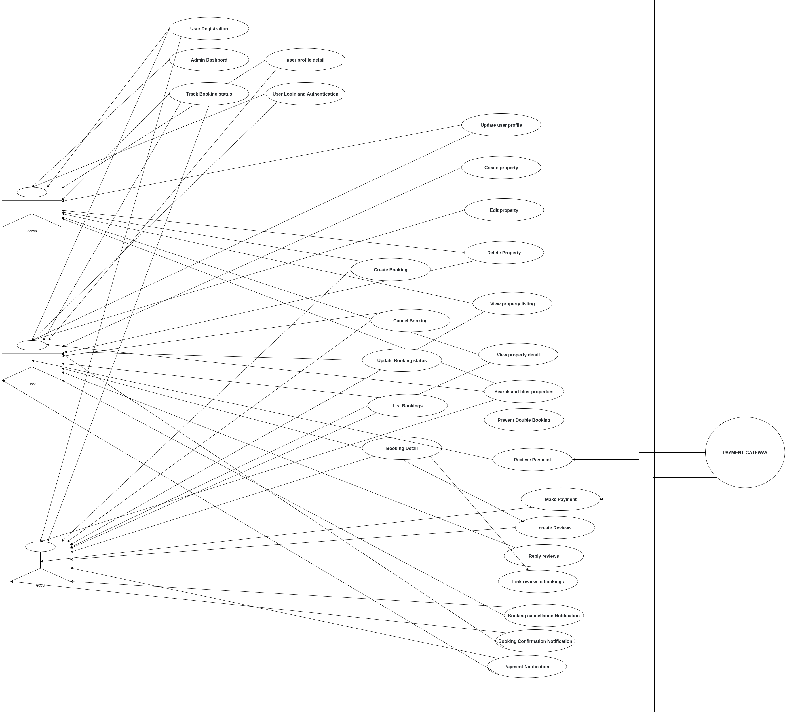

# Use Case Diagram – Airbnb Clone Backend

This directory contains the **Use Case Diagram** for the Airbnb Clone backend project.  
The diagram visualizes how different actors interact with the system and its key functionalities.

---

## 🎯 Objective
The goal of this use case diagram is to provide a high-level visualization of:
- User Registration and Authentication
- Property Listing and Management
- Booking Reservations
- Payment Processing

---

## 👥 Actors
- **Guest User** – Browses listings and registers on the platform.
- **Registered User (Traveler)** – Searches, books properties, and makes payments.
- **Host** – Lists properties, manages availability, and accepts bookings.
- **Admin** – Manages users, listings, and oversees system operations.
- **Payment Gateway** – Handles secure payment transactions.

---

## Diagram
The use case diagram was created using **[Draw.io](https://draw.io/)** and exported as a PNG.

📌 File: 
